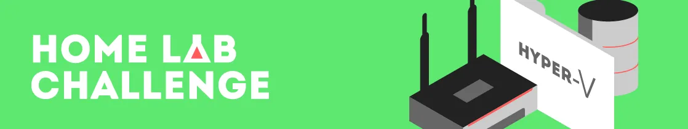

 <h1 align="center">   Virtual Home Lab Details 💻📝</h1>

In Cybersecurity, it could be a daunting task to apply and implement security concepts if there is an unavailability of practical and safe infrastructure to carry out these activities.

This is a project that keeps a simple approach while also containing key components necessary for network detection and monitoring practice. This environment is meant to provide a safe place to improve field-related skills while simulating a enterprise style architecture. In this repository, there will be quick and easy-to-understand walkthroughs of how to set up the components of this home lab.

*Disclaimer : The initial skeleton of this infrastructure was based on Day's Walkthrough on Cyberwox Academy. Links to his website will be provided below so make sure to check out his version of the setup as well as his walkthrough videos of some of the tools that were setup here.*

Link : https://cyberwoxacademy.com/building-a-cybersecurity-homelab-for-detection-monitoring/

---

### What does this Virtual Home Lab include?

- Using VMware Workstation Pro 17 (or VirtualBox) as the "Hypervisor"
- Configuring a pfSense firewall for Network Segmentation & Security
- Configuring Security Onion as an all-in-one IDS, Security Monitoring, and Log Management solution
- Configuring Kali Linux as an attack machine
- Configuring a Windows Server as a Domain Controller
- Configuring Windows desktops
- Configuring Splunk
- Additional Ubuntu/CentOS/Metasploitable/DVWA/Vulnhub machines (Exploitable Network Machines)

---

## Network Topology Diagram

Diagram provided by : Cyberwox Academy https://cyberwoxacademy.com/building-a-cybersecurity-homelab-for-detection-monitoring/

---

## Start-to-Finish Roadmap Walkthrough Order

- Start with setting up the Kali Linux virtual machine as this will be needed to setup the pfSense Firewall machine.
- Next follow the pfSense Firewall walkthrough.
- Then follow the Security Onion Setup.
