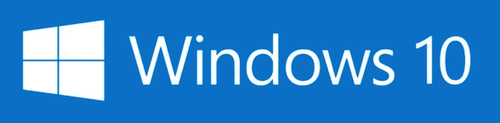

 <h1 align="center">   Windows 10 Walkthrough</h1>

  <b>Download Link to Windows 10 ISO file :   https://www.microsoft.com/en-us/evalcenter/evaluate-windows-10-enterprise</b>
   

---
## Virtual Machine Setup

This walkthrough assumes that you already know how to set up and create a virtual machine within the virutalization application of your choice (VirutalBox or VNware Workstation).
    
The recommended settings for this virtual machine are :

* **Disk Size** : 60 GB (Default)
* **Memory** : 2 GB or 4,048 MB (Default)

Additional Network Adapter Settings :

* **Network Adapter 1** : `VMnet3`

`All other settings can be left at default.`
    
Once these settings have been adjusted, start the virtual machine.

---

## Windows Server Setup and Domain Configuration
