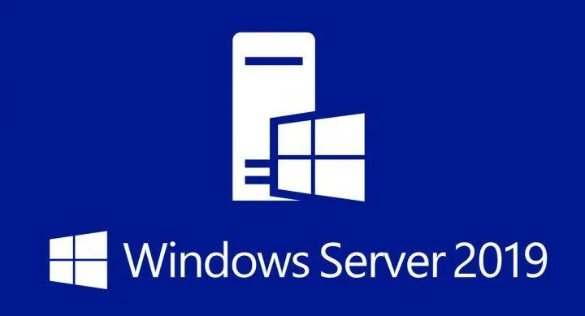

 <h1 align="center">   Windows Server 2019 Walkthrough</h1>

  <b>Download Link to Windows Server 2019 ISO file :   https://www.microsoft.com/en-us/evalcenter/evaluate-windows-server-2019 </b>
   

---
## Virtual Machine Setup

This walkthrough assumes that you already know how to set up and create a virtual machine within the virutalization application of your choice (VirutalBox or VNware Workstation).
    
The recommended settings for this virtual machine are :

* **Disk Size** : 60 GB (Default)
* **Memory** : 2 GB or 4,048 MB (Default)

Additional Network Adapter Settings :

* **Network Adapter 1** : `VMnet3`

`All other settings can be left at default.`
    
Once these settings have been adjusted, start the virtual machine.

---

## Windows Server Setup and Domain Configuration

Power on the virtual machine and immediately click any key to boot from drive.

Click `Next`.

Click `Install Now`.

A screen like the one below should pop up listed with 4 options :

Select the `Windows Server 2019 Standard Evaluation (Desktop Experience)` and click `Next`.

Accept the License Terms.

Click `Next`.

Select `Custom: Install Windows only (advanced)`.

Click `New` with the yellow sun symbol and then `Apply`. The screen should then look like the visual below :

Click `Ok`.

Click `Next` and a window with installation status should appear like the one below :

When the installation is complete, create a password for the Administration account and the machine should reboot.

Log in using the Administrator account details in the screen below :

After logging in, the dashboard of the server manager should automatically pop up as displayed below :

Next the new server needs to be renamed. Navigate to `Settings` using the windows search bar.

Search "pc name" in the settings search bar.

The about page in settings will appear. Click the `Rename this PC` button.

Type a name to identify this PC as and click `Next`. The screen should've look similar to the one below :

After the server automatically reboots, the server manager will pop back up.

Up in the top right corner of the server manager, Click `Manage` for a dropdown menu so your screen looks like the screen below :

Select `Add Roles and Features` so a new windows pops up.

Click `Next` until you get to the `Server Roles` section of the wizard.

Check the `Active Directory Domain Services` box in the long list and click `Add Features` like in the screenshot below :

Click `Next` until you get to the `Confirmation` section of the wizard.

Now click `Install`

An installation progress screen will show the status of the installation until completetion like the one below :

After the install, click `Close`.

In the server manager, click the flag buton with the yellow caution triangle in the top right corner.

Click `Promote this server to a domain controller`

An Active Directory Domain Services Configuration Wizard should appear.

In the `Deployment Configuration` section, select `Add a new forest`.

Choose a domain name like the screenshot below :

Click `Next` and set a domain forest password.

Click the `Next` button until you get to the `Prerequisites Check` section.

Wait for the check to register which will display some yellow cautions in the results box like the display below :

Click `Install` and wait for the reboot.

After the reboot, log back in.

Select the `Manage` button in the top right again and select `Add Roles and Features`.

Click `Next` until you get to the `Server Roles` section.

Check the `Active Directory Certificate Services` box in the long list and click `Add Features` like in the screenshot below :

Click `Next` until you get to the `Confirmation` section of the wizard.

Check the `Restart the destination server automatically if required` box and click `Yes`.

Click `Install`.

After the installation, click `Close` seen in the screenshot below :

In the server manager, click the flag buton with the yellow caution triangle in the top right corner.

Click `Configure Active Directory Certificate Services on the destination server` under the `Post-deployment Configuration` alert.

An AC CS Configuration Wizard should appear.

Click `Next` through the `Credentials` section.

Within the `Roles Services` section, check the `Certification Authority` box.

Click `Next` until you get to the `Validity Period` section. Change the number to `99 Years` like the screenshot below :

Click `Next` until the `Confirmation` section. Click the `Configure` button, then `Close`.

Manually reboot the server using the Windows button for all changes to take effect.

Log back into the server.

In the top right of the server manager, click the `Tools` tab to view the dropdown menu.

Select `Active Directory Users and Computers` to open manager.

Click the arrow next to the domain name on the directory list on the left side of the manager.

Right click on the `Users` folder, hover over `New`, and select `User`.

Your screen should match the screenshot below before clicking :

Enter a First, Last, & User Logon name for the new user like the window below :

(In `User logon name:`, type the "-WIN10" after the initials of the user)

Click `Next` when finished.

Assign a password to the new account and check the `Password never expires` box. Click `Next`.

Click `Finish`.

Right click the new user created and click copy like the screenshot below :

Created another user with the same method as the first. Instead of adding "-WIN10", add "-WIN7" after the initials.

Now, go to the Windows search bar and search "Windows Defender Firewall".

Click `Turn Windows Defender Firewall on or off`. Turn the firewall off for all networks to match the screenshot below :

Click `OK`.

The last configuration to the domain is to set the default gateway to the PfSense firewall.

Go to the Windows search bar and search "Control Panel".

Once the windows opens, click `Network and Internet`.

Click `View Network Connections`.

Right click on `Ethernet0` and select `Propterties`.

Double click on `Internet Protocol Version 4 (TCP/IPv4)`.

Enter the following and match the screenshot below :

Click `OK` twice and reboot the server to update the changes.

---

**Follow the steps to the Windows10-Setup Walkthrough before proceeding to the next section.**

---

## Joining the Windows 10 PCs to the Domain

